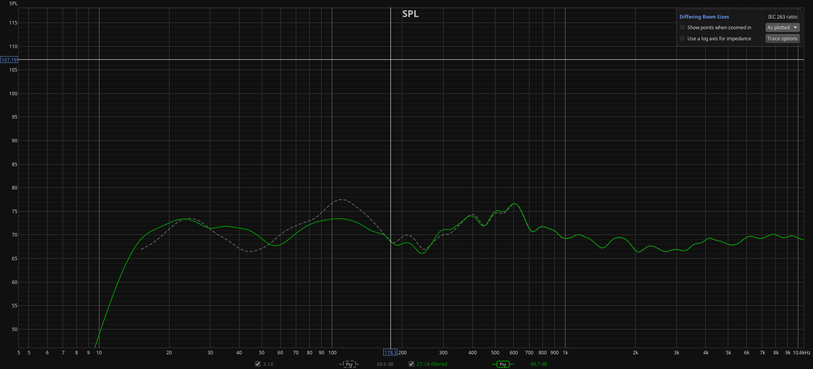
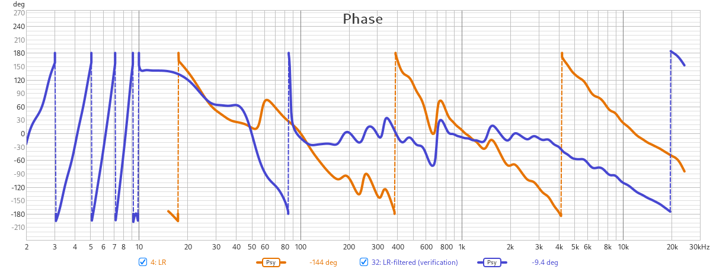
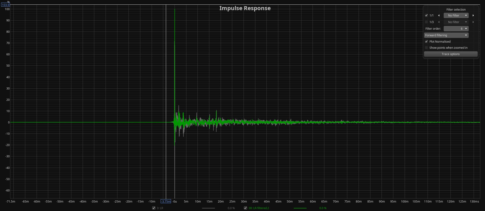
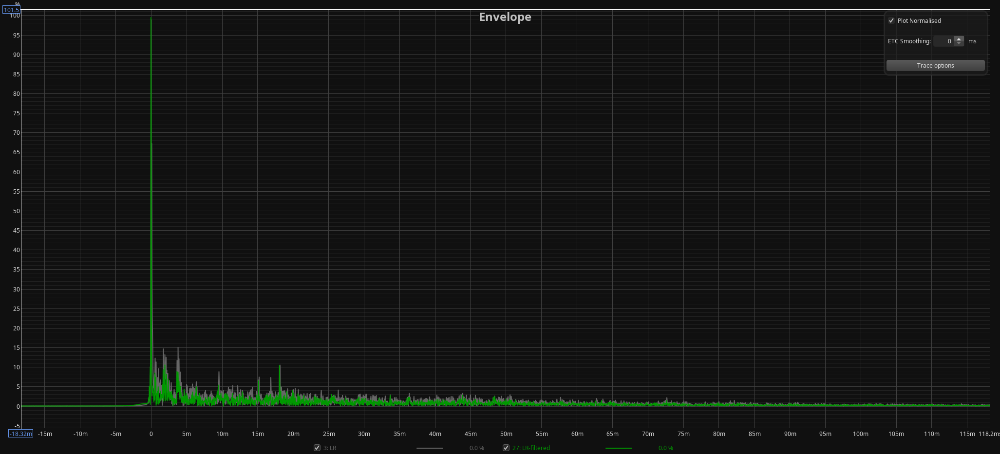

# Current configuration (2025.09.23)

## Geometry

- 120cm from front wall
- sofa at blue marks (see notebook for details)

## Filters

v.1.5.0 with two flavours

1. with max +2dB boost, peak correction with inversion, crossover correction (DRC-120.blue/120-blue-with-inversion+2dB.mdat)

2. with no boost, peak correction with inversion, crossover correction (DRC-120.blue/120-blue-with-inversion.mdat)

Revised crossover files (used in rephase): DRC-120.blue/ LR-EP-psy.txt , LR-EP-unsmoothed.txt, X801.rephase, X801.wav


### configuration

LF.0.raw -> 120.blue/FLX+0dB-192k.raw
RF.0.raw -> 120.blue/FRX+0dB-192k.raw
LF.1.raw -> 120.blue/FLX+2dB-192k.raw
RF.1.raw -> 120.blue/FRX+2dB-192k.raw


## Geometry 

- 120cm from front wall
- sofa at P6 (mic at 306cm from loudspeakers 390 from front wall)

## Filters

### v. 1.1.1 2024.11.27

- Low shelf filter has now a slope of -12dB/octave. 1.1.0 version had a (mistakenly?) -6dB/octave slope. The result leads to an improved clarity in the lowest region (< 80Hz).
- Low shelf filter cutoff at 44.50 Hz  Shape Butterworth  Slope 12 dB/oct
- Mid band EQ now has an effect compared to 1.1.0. 10ms windowing applied before EQ-ing. The bump between 300 and 700 is now tamed.

### v. 1.1.0  2024.11.25 and 2024.11.26

#### Files

1. 120cm.VBALS3dB+MF.correction.mdat
2. 2024.11.25-FVBA-LS3dB.mdat

##### Features

- crossover filters linearization (RePhase)
- no additional phase correction
- Virtual bass array filters with delayed impulse (1st mode: 55.15, second 110.3) and +3dB low shelf filter EQ
- corrective EQ until 220Hz
- corrective EQ from 221 to 693Hz (no motivation for 693, it happened, idea was to set upper limit to 700Hz) after windowing L and R to 10ms (343/3.06, being 3.06 approx speaker distance from listening position)


### files:

- 120cm.VBALS3dB+MF.correction.mdat









![Clarity [C80]: current filter vs uncorrected](doc/current.clarity.c80.png)

# Description

Configuration files, scripts, filters (raw format), ... for brutefir under Linux. 

Designed and generated from one or more of the DRC-xxx github.com/delleceste folders

# Top level directory *.conf files

The top level directory brutefir-XY.conf files are brutefir configuration files.
Each one *shall load only one brutefir filter*
XY identifies the *name* of the filter/configuration, and it is passed to the *scripts/drc.sh* script as parameter so that brutefir is launched with *brutefir-XY.conf* configuration file.
The parameter *off* is reserved and used by *scripts/drc.sh* to stop the brutefir process.

## Examples
- *brutefir-current.conf*, launched with *drc.sh current*, script pointing to the current (latest) *default* configuration
- *brutefir-last.1.conf*, second last configuration (for comparison purposes, optional)
- *brutefir-last.2.conf*, third last configuration (for comparison purposes, optional)

### Additional config files for flavors different than default

Other brutefir-XY.conf can be optionally added (to offer flavors of different corrections / equalizations).

#### Note:

Filters used in additional brutefir-XY.conf shall reside within specific subfolders, possibly self describing, and shall not clutter the *filters/* top level directory

# The filters/ directory and the symlinks to the current default filter

Contains the filters, each under a directory named after the speaker distance from the front wall. For example, a dir named *120* shall contain filters
designed for speaker placement at 120cm from the front wall. Further documentation shall define other distances, such as the listening position.

## Symlinks to the default filter currently in use

To simplify and minimize editing the brutefir configuration file, two symbolic links:

- LF.raw  (Left Filter)
- RF.raw  (Right Filter)

shall point to the *.raw* filter in use for the *current* configuration.

#  The old.pos/ directory
Configuration files referring to older speaker / listening positions shall be moved here to avoid cluttering the main directory

# scripts/headroom_calc.py

Calculates the minimum `attenuation:` value to set in each brutefir `.conf` file for a given set of filter files, in order to prevent clipping while maximising dynamics.

## How it works

brutefir processes audio entirely in float64 (effectively infinite dynamic range).
The risk of clipping arises only at the output boundary when the filter has gain > 0 dB at some frequency.

For each filter file the script:
1. Reads the raw impulse response samples (supports `FLOAT64_LE` / `S32_LE` formats)
2. Computes the FFT — each bin gives the filter's complex gain at that frequency
3. Takes `max |FFT(h)|` — the worst-case gain across all frequencies
4. Converts to dB: `headroom = 20 × log10(peak_gain)`
5. Adds a configurable safety margin (default 1 dB) and rounds up to one decimal place

Because brutefir applies **one `attenuation:` value per coeff block to both channels**, the script groups filters into L/R pairs and uses the channel with the higher peak gain to determine the pair's attenuation.

Note: minimising attenuation does **not** improve audio quality. In float64 attenuation is lossless; the only goal is to avoid clipping.

## Usage

```bash
python3 scripts/headroom_calc.py
```

Edit the `FILTER_PAIRS` list at the top of the script to add or change filter files and their formats.
Edit `SAFETY_MARGIN_DB` to adjust the margin (default: 1.0 dB).

## Results for filters/120.blue

Output of `headroom_calc.py` as of v1.5.0:

```
Pair                 Channel file                                      Peak gain Limiting ch  Suggested
──────────────────── ────────────────────────────────────────────────       (dB)            atten (dB)
+0dB float64         FLX+0dB-192k_sox_upsample_float64.raw                +1.071   ← limits        2.1
                     FRX+0dB-192k_sox_upsample_float64.raw                -0.038

+2dB float64         FLX+2dB-192k_sox_upsample_float64.raw                +3.060   ← limits        4.1
                     FRX+2dB-192k_sox_upsample_float64.raw                +1.954

+2dB trimmed S32     FLX+2dB-trimmed-192k.raw                             +3.191   ← limits        4.2
                     FRX+2dB-trimmed-192k.raw                             +2.137

Safety margin applied: 1.0 dB
```

The left channel limits in all pairs. Set `attenuation:` in the `.conf` file as follows:

| Filter pair | `attenuation:` (both channels) |
|---|---|
| `+0dB` float64 | **2.1** |
| `+2dB` float64 | **4.1** |
| `+2dB` trimmed S32 | **4.2** |

# The drc.sh script

The *drc.sh* bash script shall be located in the main folder. It starts the *brutefir* convolution engine.
Accepts one parameter, e.g. *current*. Calls *brutefir brutefir-current.conf* (the current configuration)
If the parameter equals *off*, brutefir is stopped.

Additionally, the script calls *mpc* (MPD control application) so that the audio device in *MPD* is switched to the *loopback* device targeted by brutefir or to the native device (if the parameter is *off*)

# The doc/ directory
It shall contain at least two plots (PNG format), each one with two curves: uncorrected and corrected:
- current.amplitude.png: amplitude
- current.phase.png: phase 

# USB DAC hotplug automation

Plugging in the USB DAC automatically starts brutefir and switches MPD to the DRC output.
This is implemented with a udev rule and two systemd system services.

## Event chain

```
USB DAC plugged in
  └─ udev: ACTION==add, SUBSYSTEM==sound, KERNEL==controlC*, SUBSYSTEMS==usb
       └─ SYSTEMD_WANTS=drc-usb-audio.service  (no-op if already active)
            └─ systemd starts drc-usb-audio.service
                 ├─ Wants=brutefir-drc.service  →  brutefir starts (own cgroup)
                 └─ ExecStart: mpc switches MPD output to DAC+DRC (output 3)

USB DAC unplugged
  └─ udev: ACTION==remove, SUBSYSTEM==sound, KERNEL==controlC*, SUBSYSTEMS==usb
       └─ RUN: systemctl stop drc-usb-audio.service
            ├─ ExecStop: mpc switches MPD back to output 1
            └─ PropagatesStopTo=brutefir-drc.service  →  brutefir stops
```

`RemainAfterExit=yes` on `drc-usb-audio.service` prevents the multiple `controlC*` add
events from a single plug-in from starting duplicate brutefir instances. The `remove` rule
resets the service to inactive so the next plug-in works correctly.

## Files

| File | Installed to | Purpose |
|---|---|---|
| `99-usb-audio-drc.rules` | `/etc/udev/rules.d/` | udev rule: triggers the service on DAC plug-in |
| `etc/systemd/system/brutefir-drc.service` | `/etc/systemd/system/` | Manages the brutefir process |
| `etc/systemd/system/drc-usb-audio.service` | `/etc/systemd/system/` | Switches MPD output; declares dependency on brutefir-drc |

## The udev rule (`99-usb-audio-drc.rules`)

```
ACTION=="add", SUBSYSTEM=="sound", KERNEL=="controlC*", SUBSYSTEMS=="usb",
    TAG+="systemd", ENV{SYSTEMD_WANTS}="drc-usb-audio.service"
```

- Matches any USB sound card control device (`controlC*`), regardless of DAC model.
- `TAG+="systemd"` hands the event to systemd.
- `SYSTEMD_WANTS` tells systemd to start `drc-usb-audio.service` if it is not already active.

## Why two service units

A single `Type=oneshot` service that launches brutefir and exits would have brutefir killed
by systemd when the service's cgroup is cleaned up. `KillMode=none` avoids that but is
deprecated. The correct solution is to run brutefir in its **own** service unit with its own
cgroup, so systemd tracks and manages it independently.

**`brutefir-drc.service`** — `Type=simple`, runs brutefir in the foreground (no `-daemon`
flag). systemd owns its full lifecycle: start, stop, and restart. The process stays alive
as long as this unit is active.

**`drc-usb-audio.service`** — `Type=oneshot` with `RemainAfterExit=yes`, triggered by udev.
Declares `Wants=brutefir-drc.service` so systemd starts brutefir-drc automatically, then
waits 1 s for brutefir to initialise (`ExecStartPre=/bin/sleep 1`) before switching MPD
outputs. `RemainAfterExit=yes` keeps the service "active" after ExecStart completes, so
repeated udev events (one USB device generates several `controlC*` events) are ignored and
do not launch additional brutefir instances.

## Installation

Use the Makefile at the root of the repository:

```bash
make install          # copy all files and reload udev + systemd
make install-systemd  # copy service files and reload systemd only
make install-udev     # copy udev rule and reload udev only
```

`make install` requires sudo (prompted once per target that needs it).

## Manual control

The two units are linked: stopping `drc-usb-audio.service` also stops `brutefir-drc.service`
(via `PartOf=`) and switches MPD back to the direct output (via `ExecStop`). This is the
recommended way to stop everything cleanly.

```bash
# Stop DRC completely (stops brutefir + switches MPD back to output 1)
sudo systemctl stop drc-usb-audio.service

# Start DRC manually (starts brutefir + switches MPD to output 3)
sudo systemctl start drc-usb-audio.service

# Stop/start brutefir alone (MPD output is not changed)
sudo systemctl stop  brutefir-drc.service
sudo systemctl start brutefir-drc.service

# Check status
systemctl status brutefir-drc.service
systemctl status drc-usb-audio.service

# Follow logs
journalctl -fu brutefir-drc.service
journalctl -fu drc-usb-audio.service
```

`drc.sh` continues to work for manual invocation outside of systemd (it starts brutefir
with `-daemon` directly and switches MPD outputs in one step).

## User ID note

`drc-usb-audio.service` sets `XDG_RUNTIME_DIR=/run/user/1001` (giacomo's UID).
If the UID changes, update that value in the service file and re-run `make install-systemd`.

# History and notes


