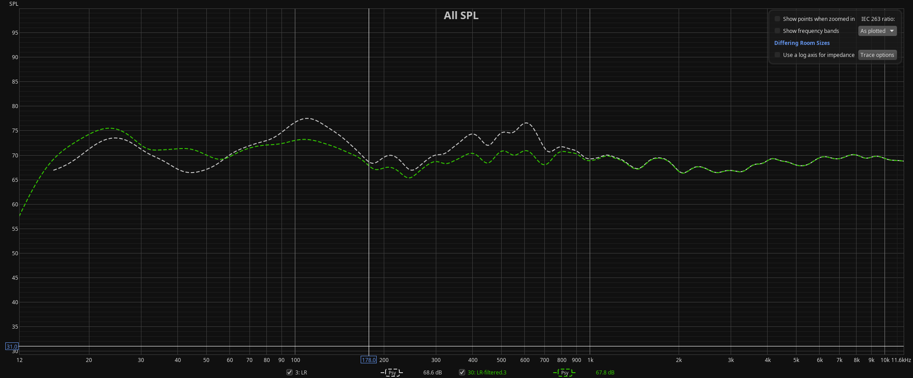
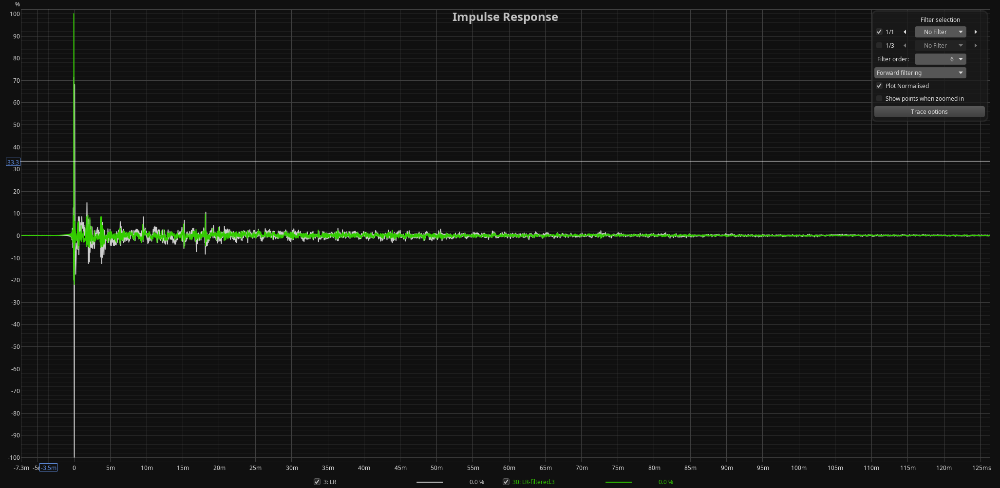
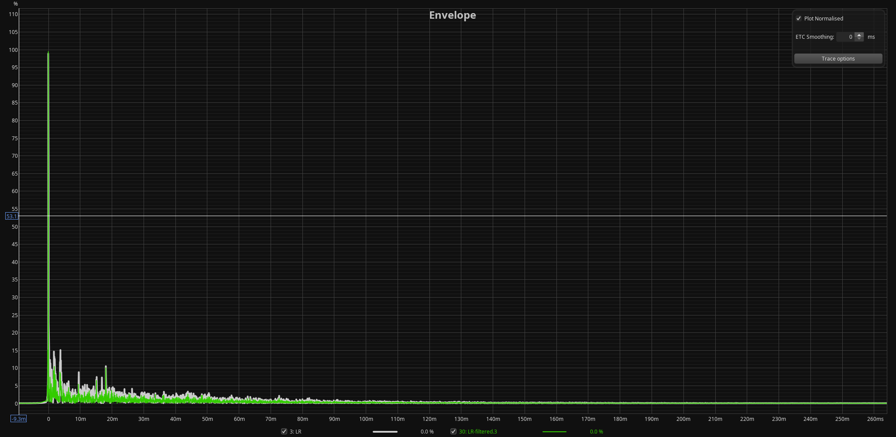
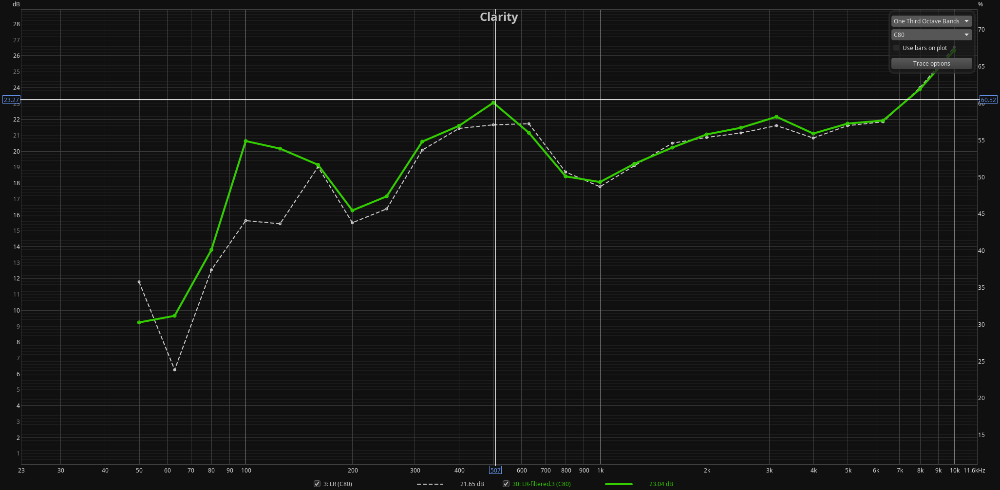

# Current configuration 

### Geometry 

- 120cm from front wall
- sofa at P6 (mic at 306cm from loudspeakers 390 from front wall)

### Filters

#### 2024.11.25

- crossover filters linearization (RePhase)
- no additional phase correction
- Virtual bass array filters with delayed impulse (1st mode: 55.15, second 110.3) and +3dB low shelf filter EQ
- corrective EQ until 220Hz

#### 2024.11.26

- corrective EQ from 221 to 693Hz (no motivation for 693, it happened, idea was to set upper limit to 700Hz) after windowing L and R to 10ms (343/3.06, being 3.06 approx speaker distance from listening position)

### files:

- 120cm.VBALS3dB+MF.correction.mdat

![Clarity [C80]: current filter vs uncorrected](doc/current.clarity.c80.png)

# Description

Configuration files, scripts, filters (raw format), ... for brutefir under Linux. 

Designed and generated from one or more of the DRC-xxx github.com/delleceste folders

# Top level directory *.conf files

The top level directory brutefir-XY.conf files are brutefir configuration files.
Each one *shall load only one brutefir filter*
XY identifies the *name* of the filter/configuration, and it is passed to the *scripts/drc.sh* script as parameter so that brutefir is launched with *brutefir-XY.conf* configuration file.
The parameter *off* is reserved and used by *scripts/drc.sh* to stop the brutefir process.

## Examples
- *brutefir-current.conf*, launched with *drc.sh current*, script pointing to the current (latest) *default* configuration
- *brutefir-last.1.conf*, second last configuration (for comparison purposes, optional)
- *brutefir-last.2.conf*, third last configuration (for comparison purposes, optional)

### Additional config files for flavors different than default

Other brutefir-XY.conf can be optionally added (to offer flavors of different corrections / equalizations).

#### Note:

Filters used in additional brutefir-XY.conf shall reside within specific subfolders, possibly self describing, and shall not clutter the *filters/* top level directory

# The filters/ directory and the symlinks to the current default filter

Contains the filters, each under a directory named after the speaker distance from the front wall. For example, a dir named *120* shall contain filters
designed for speaker placement at 120cm from the front wall. Further documentation shall define other distances, such as the listening position.

## Symlinks to the default filter currently in use

To simplify and minimize editing the brutefir configuration file, two symbolic links:

- LF.raw  (Left Filter)
- RF.raw  (Right Filter)

shall point to the *.raw* filter in use for the *current* configuration.

#  The old.pos/ directory
Configuration files referring to older speaker / listening positions shall be moved here to avoid cluttering the main directory

# The drc.sh script

The *drc.sh* bash script shall be located in the main folder. It starts the *brutefir* convolution engine.
Accepts one parameter, e.g. *current*. Calls *brutefir brutefir-current.conf* (the current configuration)
If the parameter equals *off*, brutefir is stopped.

Additionally, the script calls *mpc* (MPD control application) so that the audio device in *MPD* is switched to the *loopback* device targeted by brutefir or to the native device (if the parameter is *off*)

# The doc/ directory
It shall contain at least two plots (PNG format), each one with two curves: uncorrected and corrected:
- current.amplitude.png: amplitude
- current.phase.png: phase 

# The etc/systemd directory

Contains systemd scripts to execute *scripts/drc.sh* at boot with the last loaded configuration.

# History and notes

