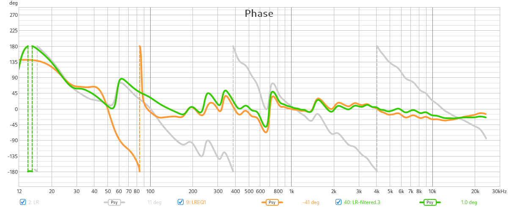
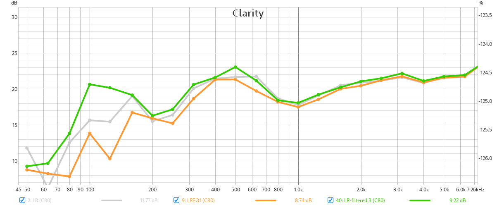

Some graphs depicting ALL-PASS phase filter solution (F=47.9Hz, Q=sqrt(2)/2) compared to the Virtual Bass Array solution.
Both apply crossover correction.
Listening reveals an undefined and smeared bass with the All-pass filter. Apparently, *clarity* is the most (only?) compromised parameter visible in REW graphs.

